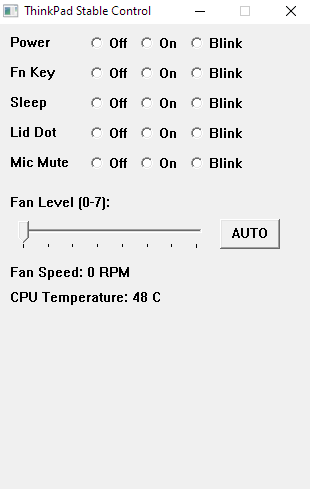

# 💻 ThinkPad Controller (T14 & Compatible)

A lightweight utility for manual Fan and LED management on ThinkPad T14 and similar models. This tool provides direct hardware access to the Embedded Controller (EC) to bypass BIOS restrictions.

---

## 🚀 Get the Tool
The compiled binary (GUI + CLI) and required drivers are available here:
### [👉 Download on Ko-fi](https://ko-fi.com/s/30db78cb9e)

---

---

## 🛠 Features
* **Fan Override:** Manual levels (0-7) and Auto.
* **LED Management:** Control Power, Fn, Sleep, Lid, and Mic LEDs (On/Off/Blink).
* **Live Monitoring:** Real-time CPU temperature and Fan RPM tracking.

## 📋 Requirements
* Windows 10/11 (64-bit)

## ⚠️ Disclaimer
This tool performs low-level hardware manipulation. Use at your own risk. The author is not responsible for hardware failure or thermal issues resulting from improper fan settings.

---
*If this project helped you, consider supporting the work on [Ko-fi](https://ko-fi.com/s/30db78cb9e).*
