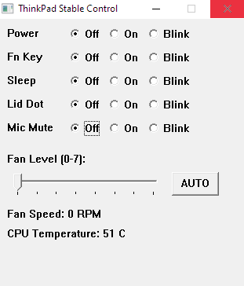

# 💻 ThinkPad LED & Fan Controller - An Alternative to WinRing0

A lightweight utility for manual Fan and LED management on ThinkPad models.

---

## 🚀 Get the Tool
The compiled binary (GUI + CLI) and required drivers are available here:
### [👉 Download on Ko-fi](https://ko-fi.com/s/30db78cb9e)

---

---

## 🛠 Features
* **Fan Override:** Manual levels (0-7) and Auto.
* **LED Management:** Control Power, Fn, Sleep, Lid, and Mic LEDs (On/Off/Blink).
* **Live Monitoring:** Real-time CPU temperature and Fan RPM tracking.

## 📋 Requirements
* Windows 10/11 (64-bit)

## ⚠️ Disclaimer
This tool performs low-level hardware manipulation. Use at your own risk. The author is not responsible for hardware failure or thermal issues resulting from improper fan settings.

---

## ⚖️ Licensing & Distribution
* **Landing Page:** The content of this repository (README and Media) is licensed under CC BY-NC-ND 4.0.
* **Software:** The **ThinkPad Control** executable and its hardening logic are proprietary. 
* **Official Source:** To ensure you are running a safe, untampered version, only download the utility from the [Official Ko-fi Store](https://ko-fi.com/s/30db78cb9e). 
* **Third-Party:** This tool uses `InpOutx64.dll` (Logix4U) as a functional dependency.
